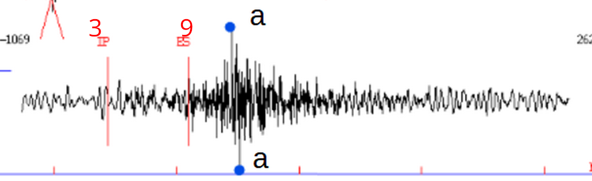
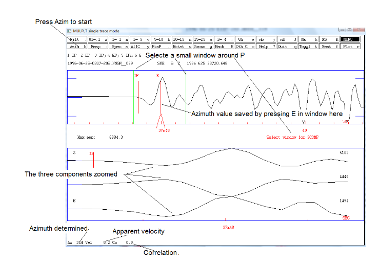

# Seisan (lab procedure)
> This procedure must be followed to analyze the earthquake data in Seisan

---
1. Open the folder in which the data is.
```
>>> cmd <enter>
>>> dirf *.*`
>>> Mulplt
>>> conts

# select the file to be analyzed by either putting its serial or copying the name of the file

# date in the format | yyyymmddhhmmss |

# time interval can be in the range of 5 to 36 minutes

>>> 0
>>> 0

# a plot of the waveform will be generated.
```

2. Find *s - p* (in order for it to zoom in): 
    - **'3'** for p-component
    - **'9'** for s-component

    (repeat this procedure for all 3 waves)

3. Click 'a' to select the highest amplitude in the wave and 'a' to again select the lowest amplitude. *as shown in the picture below*



4. Type 1 --> Type y
5. hit ok
6. go to **Menu**
7. press **Plot**
8. press **Toggle**
9. press **Azim** (Azimuth) and then select a small window around the P

> A plot will appear and it shows the 3 componesnts and the results of the correlation.

10. If this is acceptable, press *'e'* on top trace and the value are save as am **E-phase**



11. Finally, press **Plot** --> **Toggle** --> **Locate**

---
## Alternatively
> It is found that following method is found to give more precise and accurate calculations. 
---
1. after selecting *s and p*, hit **Plot** and **Toggle** the view

2. select "Wood Anderson" by hitting *'w'* on keyboard or selecting it from the Menu

3. now to select the range for WA, select a point before S (closer to it), and other outside of the greatest amplitude

4. in the second graph, press *'A'* (note that the options in seisan are case sensitive and should treated as such) to initiate an auto-amplitude, it will be denoted with **IAML** notion --> Plot it (this will save the amplitude on the current graph)


5. select the zone back and forth of the primary point (```Ip```), delete the previous ```Ip``` (by pressing 3 on the original ```Ip```, it will 'D' on top of it, signifying that its being deleted) and select a new precise ```Ip```, by hitting 3 --> save this by using the Plot command.

6. similarly, check the secondary point (```Is```), and do the necessary changes accordingly.

7. now, select **Azim** from the Menu or by hitting *h* on the keyboard, select the range around the ```Ip``` as shown in the [picture above]()

8. fix the azimuth value by pressing *E* on the plot near ```Ip``` as depicted in the picture.

9. Plot ("r" on keybord) this setting, Toggle ("t" on keybord) the view and press Locate ("l" kay on keyboard)

10. Viola! 

> :warning: **Warning:** This method is only tested on one earthquake data, to validate that this procedure is better than the last method it is advised that more evidence (in the form of earthquake data) must be provided with higher accuracy and precision.

